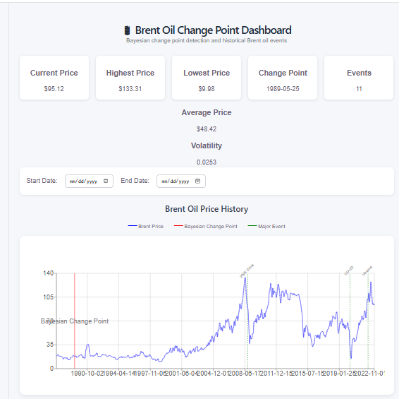
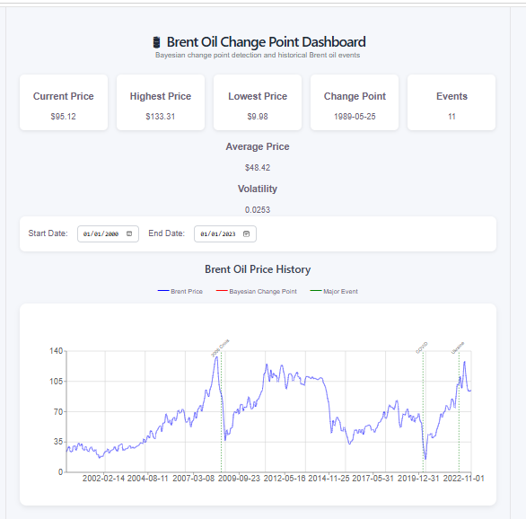

Brent Oil Change Point Analysis
Project Overview

This project analyzes historical Brent crude oil prices to identify structural changes associated with major geopolitical and economic events. The analysis combines exploratory data analysis (EDA), Bayesian change point detection, and an interactive dashboard to help stakeholders understand how significant events have influenced oil price behavior over time.

Objectives
Analyze historical Brent crude oil prices.
Explore long-term trends and volatility.
Detect structural breaks using Bayesian Change Point Analysis.
Relate detected change points to major geopolitical and economic events.
Build an interactive dashboard for visualizing analysis results.
Project Workflow
Historical Brent Oil Prices
           │
           ▼
     Data Cleaning
           │
           ▼
 Exploratory Data Analysis
           │
           ▼
   Stationarity & Volatility
           │
           ▼
 Bayesian Change Point Model
           │
           ▼
      Flask REST API
           │
           ▼
     React Dashboard
Project Structure
brent-oil-change-point-analysis/

├── backend/
│   ├── app.py
│   └── data/
│       ├── BrentOilPrices.csv
│       └── events.csv
│
├── frontend/
│   ├── src/
│   ├── public/
│   └── package.json
│
├── notebooks/
│   └── task2_analysis.ipynb
│
├── docs/
│   ├── dashboard.png
│   ├── filtered_dashboard.png
│   └── event_highlight.png
│
├── requirements.txt
└── README.md
Technologies Used
Backend
Python
Flask
Pandas
NumPy
PyMC
Statsmodels
Frontend
React
Recharts
Axios
CSS
Development Tools
Git
GitHub
Jupyter Notebook
VS Code
Bayesian Change Point Model

The Bayesian model estimates the point where the statistical behavior of Brent oil price returns changes.

Model parameters include:

τ (tau): Change point
μ₁: Mean return before the change point
μ₂: Mean return after the change point
σ: Volatility

Sampling configuration:

Draws: 100
Tune: 100
Chains: 1
Results

Estimated change point:

25 May 1989

Estimated average log return:

Before change:

-0.015%

After change:

+0.037%

Estimated volatility:

σ ≈ 0.029
Interactive Dashboard

The dashboard provides:

Brent oil price visualization
Bayesian change point marker
Historical event markers
KPI summary cards
Date filtering
Interactive tooltips
Responsive layout
API Endpoints
Endpoint	Description
GET /prices	Returns historical Brent oil prices
GET /change-points	Returns Bayesian change point results
GET /events	Returns major historical events
Dashboard Screenshots
Main Dashboard
docs/dashboard.png

(After uploading to GitHub, replace the text above with:)

Filtered Dashboard

Event Highlight

Limitations

Due to hardware limitations, Bayesian inference was performed on the first 1,000 observations using 100 posterior draws.

This configuration demonstrates the Bayesian change point methodology while maintaining practical execution time.

Future Work

Future improvements may include:

Running Bayesian inference on the complete dataset using greater computational resources.
Incorporating macroeconomic variables such as GDP, inflation, and exchange rates.
Comparing Bayesian change point detection with alternative structural break models.
Adding interactive filtering by event type.
Deploying the dashboard as a web application.
Conclusion

This project demonstrates how Bayesian Change Point Analysis can identify structural changes in Brent crude oil prices and how an interactive dashboard can communicate these insights effectively. The combination of statistical modeling and visualization provides stakeholders with a practical tool for exploring historical oil market behavior.
